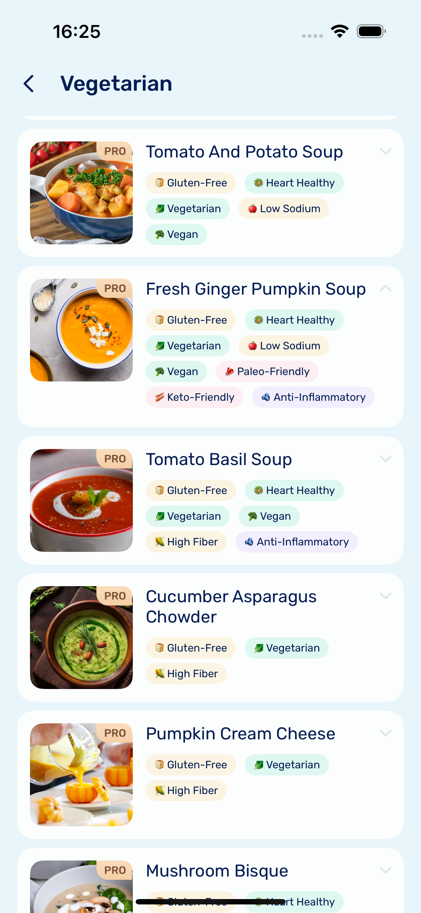

### 前情提要

当产品过来告诉你，要在一个card中展示一个标签列表，行与列都是尽可能多的展现。而且会有一个按钮，因为标签列表可能会很多，所以这个按钮就是用来收缩标签列表： 效果图如下:



我们可以看到，第一个card默认能够展示三行标签，展开后，展示四行，对应的card高度也会随之变化。

那么对于这种布局，我们应该怎么解决呢？同样的案例在UIKit中，我们其实需要定义UICollectionViewLayout才能实现，并且我们需要提前知道每个cell的size，然后通过size去决定他们的布局。

但是通过SwiftUI的Layout我们就可以非常快速的迭代生成类似的布局.

### 使用Layout完成标签布局

```swift
struct TagLayout: Layout {
    
    let spacing: CGFloat
    
    func makeCache(subviews: Subviews) -> TagSizeCatch {
        .init()
    }
    
    func sizeThatFits(proposal: ProposedViewSize, subviews: Subviews, cache: inout TagSizeCatch) -> CGSize {
        guard !subviews.isEmpty else { return .zero }
        for i in subviews.indices {
            let subview = subviews[i]
            let viewDimension = subview.dimensions(in: proposal)
            cache.sizes.append(.init(width: viewDimension.width, height: viewDimension.height))
        }
        return .init(
            width: proposal.replacingUnspecifiedDimensions().width,
            height: proposal.replacingUnspecifiedDimensions().height
        )
    }
    
  // 视图中，自定义子视图的布局。
    func placeSubviews(in bounds: CGRect, proposal: ProposedViewSize, subviews: Subviews, cache: inout TagSizeCatch) {
        let maxWidth = bounds.width

        var x = bounds.minX, y = bounds.minY
        for i in subviews.indices {
            let subview = subviews[i]
            let width = cache.sizes[i].width
          // 当子视图的宽度超过父视图的宽度的时候，就换行。
            if (x + spacing + width) > maxWidth {
                x = bounds.minX
                y += spacing + cache.sizes[i].height
            }
            subview.place(
                at: CGPoint(x: x, y: y),
                anchor: .topLeading,
                proposal: proposal
            )
            x += width + spacing
        }
    }
    
}

struct TagSizeCatch {
    var sizes: [CGSize] = []
}
```

是不是非常方便，使用：

```swift
struct TagView: View {
    
    let tags: [String] = [
        "123", "456", "faifajfa", "fahkfajfka",
        "awyqiruiqrjoqiroqiroqirq", "ajkfaklfkalksla",
        "34567", "123"
    ]
    
    var body: some View {
        VStack {
            TagLayout(spacing: 8) {
                ForEach(tags, id: \.self) { tag in
                    Text(tag)
                        .font(.system(size: 14, weight: .medium))
                        .foregroundColor(.black)
                        .padding()
                        .background(
                            RoundedRectangle(cornerRadius: 8)
                                .fill(Color.blue)
                        )
                }
            }
            .frame(height: 200)
            .background(Color.red)
            .clipped()
        }
    }
}
```

效果如下：


`func placeSubviews(in bounds: CGRect, proposal: ProposedViewSize, subviews: Subviews, cache: inout TagSizeCatch)`

需要注意的点在于这个函数中的bounds，其实更像是我们的UIKit中的Frame，光看名字很容易被误解。
